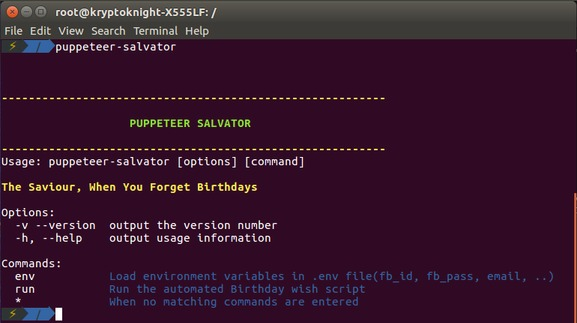

# Salvator: The Saviour, When You Forget Birthdays

[](https://gitter.im/salvator_/Lobby?utm_source=badge&utm_medium=badge&utm_campaign=pr-badge&utm_content=badge)

## What is Salvator?
Salvator is a bot which uses puppeteer to scrape the list of birthdays from facebook and sends them a personal
message.

It also sends the user an email notification with the list of birthdays and their profile link.



## How does it work?
Puppeteer uses a headless browser to navigate to `facebook.com/login` and using the credentials from the `.env` file,
logs in. There after it navigates to the birthday events page, scrapes the profile links for birthday people, forms
the messenger link using it and sends them a personalised message.<br/>
E.g `Hey thealphadollar! Happy Birthday :D`, if user's first name is "thealphadollar".The message is randomized from a stored list.

To avoid sending multiple wishes, the program creates a json file with a timestamp and a list with the links already wished. When the file is read, if the timestamp matches the day, the redundancies are avoided.

## Install
Salvator can be installed using npm or source.

* ### Install using npm
    1. [Install npm](https://www.npmjs.com/get-npm)
    2. `npm install -g puppeteer-salvator`

* ### Build using source (**RECOMMENDED**)
    1. `git clone https://www.github.com/thealphadollar/salvator`
    2. `cd salvator`
    3. [Install npm](https://www.npmjs.com/get-npm)
    4. `npm install` (this step installs all the dependencies)

**NOTE: In case of any errors related to launching headless chrome, [install google-chrome-stable](https://www.linuxbabe.com/ubuntu/install-google-chrome-ubuntu-16-04-lts).
 It'll resolve all the dependency issues.**

## Using Salvator
Before running Salvator, the following environment variables must be set to avail full functionality of the client:
```$xslt
FB_ID=<your login email/phone for facebook>
FB_PASS=<your login password for facebook>
EMAIL=<notification will be sent from this address>
EMAIL_PASS=<password for the email>
MAILTO=<notification will be sent to this address>
```
**RECOMMENDED** : Create a `.env` file in the `salvator` folder with the above mentioned environment variables.

**NOTE** : You also need to [enable access to less secure apps](https://support.google.com/a/answer/6260879?hl=en) in your GMail account (the
client only supports sending from gmail accounts).


After you are done with *installation*, Salvator can be launched manually using the commands :
- `puppeteer-salvator`, if installed from npm
- `node index.js`, from source directory

However, it is recommended to [add a cronjob](https://www.cyberciti.biz/faq/how-do-i-add-jobs-to-cron-under-linux-or-unix-oses/) to automatically launch the client at the desired time,
favorable 00:05 hours. By this time facebook updates the list of birthdays and hence you could be among the first to
 wish.

For example, the below cronjob launches the script everyday at 00:05 (local system timezone is followed) and logs the sys.stdout into cron.log
```
5 0 * * * nodejs /path/to/salvator/index.js >> ~/cron.log
```

The cronjob can be added by executing the file cron.sh

Make sure the file has appropriate permissions and if not run the following
```
chmod a+x cron.sh
```

## Contributing
Contributions are welcome, please look in the issues tab to contribute.
*   VSCode is recommended as the editor for this project.
*   Install eslint plugin for vscode.
*   Use this [video][1] to setup eslint-prettier for vscode.
*   Please read CONTRIBUTING.md guide to know more.

[1]: https://www.youtube.com/watch?v=YIvjKId9m2c
